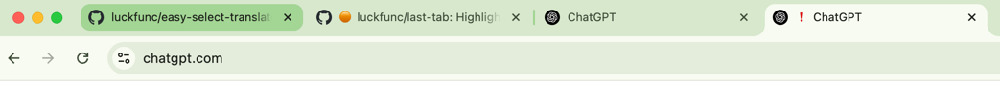

# Last Tab

**Last Tab** is a lightweight Chrome extension that helps you remember the last visited tab on the same website. It's perfect for users who often open multiple tabs from the same domain and want to easily return to where they left off.

## 📸 preview

## 🧠 Features

- 🔖 Automatically highlights the last visited tab of a specific website
- 📌 Works across all websites (`<all_urls>`)
- 💾 Saves last visited tab info using Chrome's storage API
- ⚙️ Runs in the background with minimal performance impact
- 📄 Simple popup UI for quick access (optional)

## 📦 Installation

1. Clone or download this repository.
2. Open Chrome and navigate to `chrome://extensions/`.
3. Enable **Developer mode** (top right corner).
4. Click **Load unpacked** and select the project folder.

## 🚀 How It Works

- When you visit a website, the extension stores the current tab ID and URL.
- If you open multiple tabs from the same site, **Last Tab** highlights or remembers the most recently active one.
- When returning to that site, the extension can help guide you back to the "last tab".

## 🛠️ Tech Stack

- JavaScript
- Chrome Extensions API (Manifest V3)
- HTML/CSS for popup

## 📌 Permissions Used

- `tabs` - To monitor tab updates and activations
- `storage` - To persist last visited tab data
- `scripting` - To inject content scripts
- `host_permissions: <all_urls>` - To apply the logic across all sites

## 📈 Roadmap

- [ ] Add options page for customizing behavior
- [ ] Sync tab history across devices
- [ ] Support for session recovery
- [ ] Add dark mode for popup UI

## 📃 License

MIT License

---

Made with ❤️ by [luckfunc]
